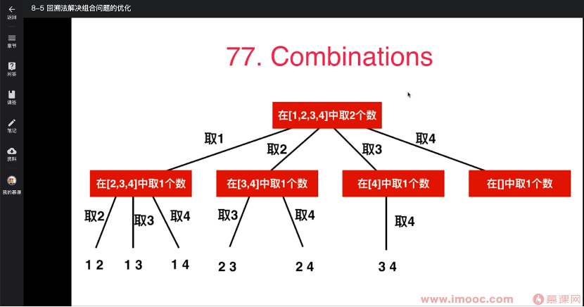
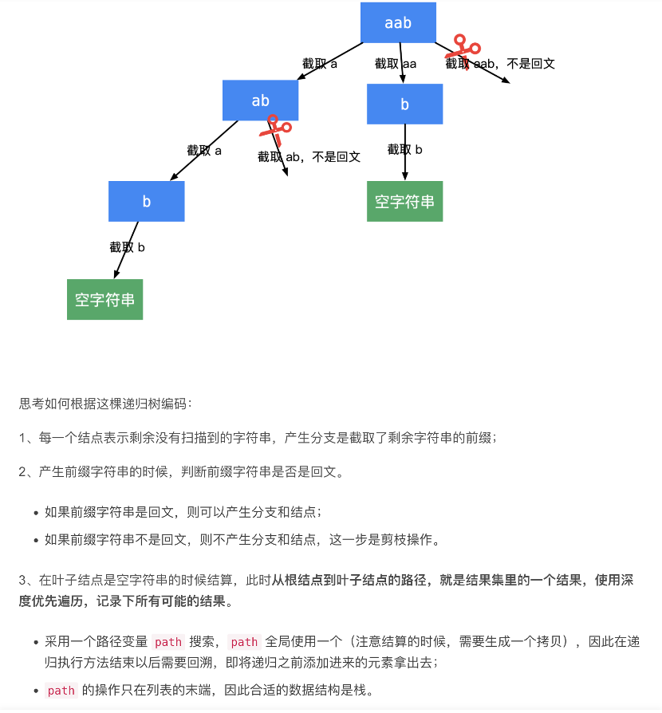

 leetcode46. 全排列
 给定一个不含重复数字的数组 nums ，返回其 所有可能的全排列 。你可以 按任意顺序 返回答案。

 示例 1：
 输入：nums = [1,2,3]
 输出：[[1,2,3],[1,3,2],[2,1,3],[2,3,1],[3,1,2],[3,2,1]]

 示例 2：
 输入：nums = [0,1]
 输出：[[0,1],[1,0]]

 示例 3：
 输入：nums = [1]
 输出：[[1]]

 思路：
 典型的全排列问题，树形问题。用回溯法


```
public class Solution46 {
    private static final String TAG="Solution46 ";
    boolean[] used;
    List<List<Integer>> res = new ArrayList<>();
    public static void main(String[] args) {
        int[] nums = {1,2,3};
        System.out.println(new Solution46().permute(nums));
    }

    public List<List<Integer>> permute(int[] nums) {
        used = new boolean[nums.length];
        backtrack(nums, 0, new ArrayList<Integer>());
        return res;
    }

    //path中保存了一个有index个元素的排列
    //向这个排列的末尾添加第index+1个元素，获得一个有index+1个元素的排列
    private void backtrack(int[] nums,int depth, ArrayList<Integer> path) {
        if (depth == nums.length) {//也可以用 if(path.size() == nums.length)
            res.add(new ArrayList<>(path));//要new 因为每个递归回溯都用同一个path。不new则最后path是空，输出全空
            return;
        }
        for (int i = 0; i < nums.length; i++) {
            if (!used[i]) {//used[i]的意义是：辅助判断nums[i]是否在path中，防止元素重复使用导致输出   [[1, 1, 1], [1, 1, 2], [1, 1, 3], [1, 2, 1], [1, 2, 2], [1, 2, 3], [1, 3, 1], [1, 3, 2], [1, 3, 3], [2, 1, 1], [2, 1, 2], [2, 1, 3], [2, 2, 1], [2, 2, 2], [2, 2, 3], [2, 3, 1], [2, 3, 2], [2, 3, 3], [3, 1, 1], [3, 1, 2], [3, 1, 3], [3, 2, 1], [3, 2, 2], [3, 2, 3], [3, 3, 1], [3, 3, 2], [3, 3, 3]]
                path.add(nums[i]);
                used[i] = true;
                backtrack(nums,depth+1, path);//path中保存了一个有index个元素的排列
                path.remove(path.size() - 1);
                used[i] = false;
            }
        }
    }
}
```


 leetcode77。组合
 给出两个整数n和k，求在1...n这n个数字中选出k个数字的所有组合。
 如 n=4,  k=2
 结果为[[1,2],[1,3],[1,4],[2,3],[2,4],[3,4]]
 
 思路：组合问题。与leetcode46排列问题相似，就是递归处理差异


```
public class Solution77 {
    public static void main(String[] args) {
        System.out.println(new Solution77().combine(4,2));
    }
    public List<List<Integer>> res = new ArrayList<List<Integer>>();
    List<Integer> path = new ArrayList<>();
    public List<List<Integer>> combine(int n , int k){
        backtrack(n,k,1);
        return res;
    }

    private void backtrack(int n, int k, int startIndex) {
        if (path.size() == k){
            res.add(new ArrayList<Integer>(path));
            return;
        }
        for (int i = startIndex;i<=n;i++){
            path.add(i);
            backtrack(n,k,i+1);
            path.remove(path.size()-1);
        }
    }
}
```
 leetcode77 注意点：
 for(int i = startIndex)不是从0开始。对比上面leetcode46。因为
    Leetcode46排列问题，[1,3]和[3,1]是两个解，所以for从0开始
    Leetcode77组合问题，[1,3]和[3,1]是一个解，所以for从startIndex开始
 此题也没有像leetcode46那样用used[i]。
    因为for从startIndex开始，不存在重复使用问题


 131. 分割回文串
 给你一个字符串 s，请你将 s 分割成一些子串，使每个子串都是 回文串 。返回 s 所有可能的分割方案。
 回文串 是正着读和反着读都一样的字符串。

 示例 1：
 输入：s = "aab"
 输出：[["a","a","b"],["aa","b"]]



 ```
public class Solution131 {

    public static void main(String[] args) {
        System.out.println(new Solution131().partition("aab"));
    }
    List<List<String>> res = new ArrayList<>();
    List<String> path = new ArrayList<>();
    public List<List<String>> partition(String s) {
        int len = s.length();
        if (len == 0) {
            return res;
        }
        backtracking(s, 0, len);
        return res;
    }

    // 方法定义：我只处理我这一层
    // 我接收startIndex。从 startIndex 到 i 往后遍历如果我 [startIndex...i]
    // 是回文
    //      则添加到path中
    //      我再调用子，传i+1，你从i+1往后找看没有没回文子串(比如我是aa了，那子你就从b往后找有则添加到path中)
    // 不是回文
    //      则continue减枝
    private void backtracking(String s, int startIndex, int n) {
        if (startIndex == n) {//终止条件startIndex到末尾了
            res.add(new ArrayList<>(path));
            return;
        }

        for (int i = startIndex; i < n; i++) {
            // 因为截取字符串是消耗性能的，因此，采用传子串索引的方式判断一个子串是否是回文子串
            // 不是的话，剪枝
            if (!checkPalindrome(s, startIndex, i)) {
                continue;
            }

            path.add(s.substring(startIndex, i + 1));//如果前缀字符串是回文，则添加到path中，并且可以产生分支
            backtracking(s, i + 1, n);
            path.remove(path.size() - 1);
        }
    }

    //这一步的时间复杂度是 O(N)，因此，可以采用动态规划先把回文子串的结果记录在一个表格里
    private boolean checkPalindrome(String str, int left, int right) {
        // 严格小于即可
        while (left < right) {
            if (str.charAt(left) != str.charAt(right)) {
                return false;
            }
            left++;
            right--;
        }
        return true;
    }
}
```
